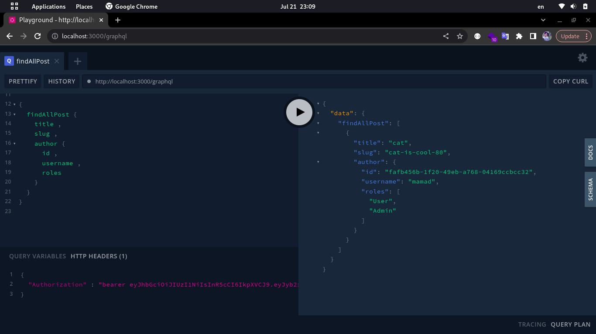
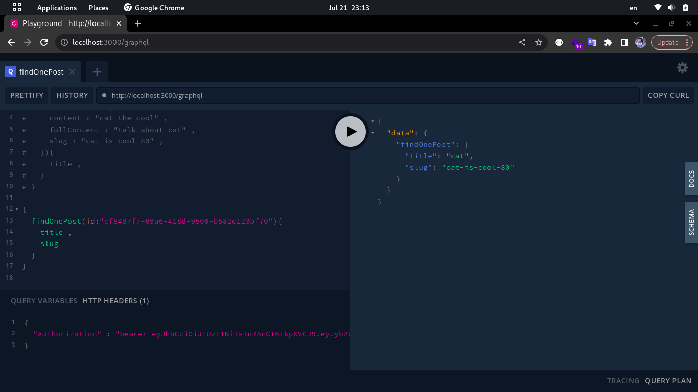
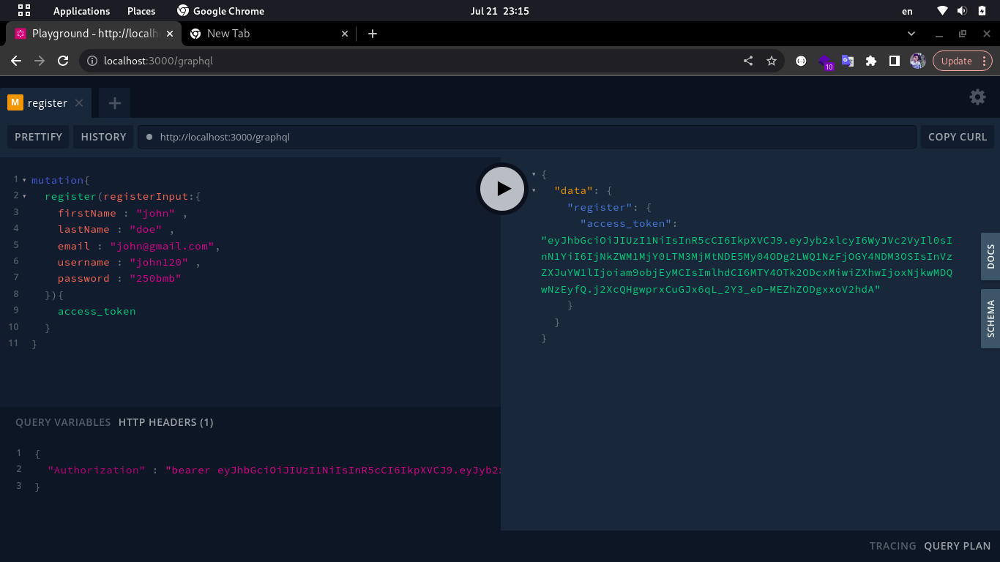
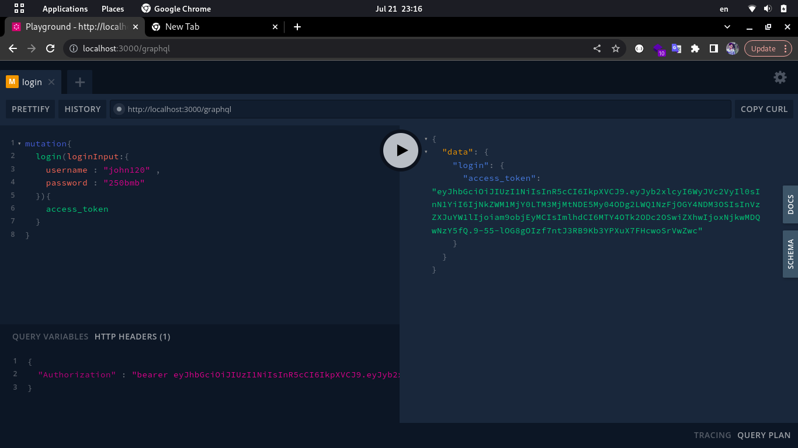

# GraphQL Project with TypeScript and NestJS

This project is a GraphQL-based application implemented using TypeScript and NestJS. It provides a set of APIs to manage various entities such as posts, users, tags, sliders, FAQs, menu positions, menu items, categories, and their relationships.

## Entity Schema

The project consists of the following entities and their corresponding attributes:

- Posts (id, title, slug, content, fullcontent, createdAt, updatedAt, author)
- Users (id, username, hashedPassword, email, firstName, lastName, name, role_id)
- User Permissions (user_id, key, value=0 or 1)
  - post-edit
  - post-insert
  - post-delete
  - tag-edit
  - tag-insert
  - tag-delete
  - faq-insert
  - faq-delete
  - faq-edit
  - menu_positions-insert
  - menu_positions-delete
  - menu_positions-edit
  - menu_items-insert
  - menu_items-delete
  - menu_items-edit
  - slider-insert
  - slider-delete
  - slider-edit
- Slider Positions (id, name, slug)
- Slider Slides (id, slider_position_id, image, title, description, link)
- Tags (id, text)
- Post Tags (id, post_id, tag_id)
- Contact Us (id, firstName, lastName, email, tel, text)
- FAQs (id, question, answer)
- Menu Positions (id, name, slug)
- Menu Items (id, menu_position_id, name, link, parent_id=null)
- Categories (id, name, slug, parent_id=null)
- Post Categories (id, post_id, category_id)

## Demo









## Installation

To run this GraphQL project locally, follow the instructions below:

Clone the repository:

```bash
git clone https://github.com/BaseMax/GeneralCMSGraphQLTS.git
```

Navigate to the project directory:

```bash
cd GeneralCMSGraphQLTS
```

Install the dependencies:

```bash
npm install
```

Set up the environment variables:

Create a .env file in the project root.
Define the required environment variables (e.g., database connection details, API keys, etc.) in the .env file.

```
mv .env.example .env
```

Start the application:

```bash
npm run start:dev

```

The application should now be running locally on the specified port.

## GraphQL API

Once the application is running, you can interact with the GraphQL API using a GraphQL client or a tool like GraphiQL or GraphQL Playground. The GraphQL endpoint will be available at `http://localhost:<port>/graphql`.

The API provides various queries and mutations to perform CRUD operations on the entities mentioned above. You can explore the available queries and mutations by accessing the GraphQL endpoint and referring to the provided documentation or schema.

## GraphQL

### Queries

- `getAllPosts`: Retrieves a list of all posts.
- `getPostById(id: ID!)`: Retrieves a specific post by its ID.
- `getAllUsers`: Retrieves a list of all users.
- `getUserById(id: ID!)`: Retrieves a specific user by their ID.
- `getAllTags`: Retrieves a list of all tags.
- `getTagById(id: ID!)`: Retrieves a specific tag by its ID.
- `getAllSliderPositions`: Retrieves a list of all slider positions.
- `getSliderPositionById(id: ID!)`: Retrieves a specific slider position by its ID.
- `getAllSliderSlides`: Retrieves a list of all slider slides.
- `getSliderSlideById(id: ID!)`: Retrieves a specific slider slide by its ID.
- `getAllFAQs`: Retrieves a list of all FAQs.
- `getFAQById(id: ID!)`: Retrieves a specific FAQ by its ID.
- `getAllMenuPositions`: Retrieves a list of all menu positions.
- `getMenuPositionById(id: ID!)`: Retrieves a specific menu position by its ID.
- `getAllMenuItems`: Retrieves a list of all menu items.
- `getMenuItemById(id: ID!)`: Retrieves a specific menu item by its ID.
- `getAllCategories`: Retrieves a list of all categories.
- `getCategoryById(id: ID!)`: Retrieves a specific category by its ID.

### Mutations

- `createPost(input: CreatePostInput!):` Post: Creates a new post.
- `updatePost(id: ID!, input: UpdatePostInput!):` Post: Updates an existing post.
- `deletePost(id: ID!):` ID: Deletes a post by its ID.
- `createUser(input: CreateUserInput!):` User: Creates a new user.
- `updateUser(id: ID!, input: UpdateUserInput!):` User: Updates an existing user.
- `deleteUser(id: ID!):` ID: Deletes a user by their ID.
- `createTag(input: CreateTagInput!):` Tag: Creates a new tag.
- `updateTag(id: ID!, input: UpdateTagInput!):` Tag: Updates an existing tag.
- `deleteTag(id: ID!):` ID: Deletes a tag by its ID.
- `createSliderPosition(input: CreateSliderPositionInput!):` SliderPosition: Creates a new slider position.
- `updateSliderPosition(id: ID!, input: UpdateSliderPositionInput!):` SliderPosition: Updates an existing slider position.
- `deleteSliderPosition(id: ID!):` ID: Deletes a slider position by its ID.
- `createSliderSlide(input: CreateSliderSlideInput!):` SliderSlide: Creates a new slider slide.
- `updateSliderSlide(id: ID!, input: UpdateSliderSlideInput!):` SliderSlide: Updates an existing slider slide.
- `deleteSliderSlide(id: ID!):` ID: Deletes a slider slide by its ID.
- `createFAQ(input: CreateFAQInput!):` FAQ: Creates a new FAQ.
- `updateFAQ(id: ID!, input: UpdateFAQInput!):` FAQ: Updates an existing FAQ.
- `deleteFAQ(id: ID!):` ID: Deletes an FAQ by its ID.
- `createMenuPosition(input: CreateMenuPositionInput!):` MenuPosition: Creates a new menu position.
- `updateMenuPosition(id: ID!, input: UpdateMenuPositionInput!):` MenuPosition: Updates an existing menu position.
- `deleteMenuPosition(id: ID!):` ID: Deletes a menu position by its ID.
- `createMenuItem(input: CreateMenuItemInput!): MenuItem: Creates a new menu item.
- `updateMenuItem(id: ID!, input: UpdateMenuItemInput!):` MenuItem: Updates an existing menu item.
- `deleteMenuItem(id: ID!):` ID: Deletes a menu item by its ID.
- `createCategory(input: CreateCategoryInput!):` Category: Creates a new category.
- `updateCategory(id: ID!, input: UpdateCategoryInput!):` Category: Updates an existing category.
- `deleteCategory(id: ID!):` ID: Deletes a category by its ID.

Note: The input and output types mentioned in the above queries and mutations are placeholders and may vary based on your specific implementation. Please refer to the project's GraphQL schema for accurate types and field definitions.

## Contributing

If you want to contribute to this project, you can follow the steps below:

- Fork the repository.
- Create a new branch for your feature or bug fix.
- Make the necessary changes.
- Commit and push your changes to the branch.
- Submit a pull request, explaining the changes you made and their purpose.
- Please make sure to follow the existing coding style and include appropriate tests for your changes.


## GraphQL Scheme

```graphql
type Post {
  id: ID!
  title: String!
  slug: String!
  content: String!
  fullContent: String!
  createdAt: String!
  updatedAt: String!
  author: User!
  tags: [Tag!]!
  categories: [Category!]!
}

type User {
  id: ID!
  username: String!
  hashedPassword: String!
  email: String!
  firstName: String!
  lastName: String!
  name: String!
  role: Role!
}

type UserPermissions {
  user_id: ID!
  key: String!
  value: Int!
}

type SliderPosition {
  id: ID!
  name: String!
  slug: String!
  slides: [SliderSlide!]!
}

type SliderSlide {
  id: ID!
  sliderPosition: SliderPosition!
  image: String!
  title: String!
  description: String!
  link: String!
}

type Tag {
  id: ID!
  text: String!
  posts: [Post!]!
}

type ContactUs {
  id: ID!
  firstName: String!
  lastName: String!
  email: String!
  tel: String!
  text: String!
}

type FAQ {
  id: ID!
  question: String!
  answer: String!
}

type MenuPosition {
  id: ID!
  name: String!
  slug: String!
  menuItems: [MenuItem!]!
}

type MenuItem {
  id: ID!
  menuPosition: MenuPosition!
  name: String!
  link: String!
  parent: MenuItem
}

type Category {
  id: ID!
  name: String!
  slug: String!
  parent: Category
  posts: [Post!]!
}

input CreatePostInput {
  title: String!
  slug: String!
  content: String!
  fullContent: String!
  authorId: ID!
  tagIds: [ID!]!
  categoryIds: [ID!]!
}

input UpdatePostInput {
  title: String
  slug: String
  content: String
  fullContent: String
  authorId: ID
  tagIds: [ID!]
  categoryIds: [ID!]
}

input CreateUserInput {
  username: String!
  hashedPassword: String!
  email: String!
  firstName: String!
  lastName: String!
  roleId: ID!
}

input UpdateUserInput {
  username: String
  hashedPassword: String
  email: String
  firstName: String
  lastName: String
  roleId: ID
}

input CreateTagInput {
  text: String!
}

input UpdateTagInput {
  text: String
}

input CreateSliderPositionInput {
  name: String!
  slug: String!
}

input UpdateSliderPositionInput {
  name: String
  slug: String
}

input CreateSliderSlideInput {
  sliderPositionId: ID!
  image: String!
  title: String!
  description: String!
  link: String!
}

input UpdateSliderSlideInput {
  sliderPositionId: ID
  image: String
  title: String
  description: String
  link: String
}

input CreateFAQInput {
  question: String!
  answer: String!
}

input UpdateFAQInput {
  question: String
  answer: String
}

input CreateMenuPositionInput {
  name: String!
  slug: String!
}

input UpdateMenuPositionInput {
  name: String
  slug: String
}

input CreateMenuItemInput {
  menuPositionId: ID!
  name: String!
  link: String!
  parentId: ID
}

input UpdateMenuItemInput {
  menuPositionId: ID
  name: String
  link: String
  parentId: ID
}

input CreateCategoryInput {
  name: String!
  slug: String!
  parentId: ID
}

input UpdateCategoryInput {
  name: String
  slug: String
  parentId: ID
}

type Query {
  getAllPosts: [Post!]!
  getPostById(id: ID!): Post
  getAllUsers: [User!]!
  getUserById(id: ID!): User
  getAllTags: [Tag!]!
  getTagById(id: ID!): Tag
  getAllSliderPositions: [SliderPosition!]!
  getSliderPositionById(id: ID!): SliderPosition
  getAllSliderSlides: [SliderSlide!]!
  getSliderSlideById(id: ID!): SliderSlide
  getAllFAQs: [FAQ!]!
  getFAQById(id: ID!): FAQ
  getAllMenuPositions: [MenuPosition!]!
  getMenuPositionById(id: ID!): MenuPosition
  getAllMenuItems: [MenuItem!]!
  getMenuItemById(id: ID!): MenuItem
  getAllCategories: [Category!]!
  getCategoryById(id: ID!): Category
}

type Mutation {
  createPost(input: CreatePostInput!): Post
  updatePost(id: ID!, input: UpdatePostInput!): Post
  deletePost(id: ID!): ID
  createUser(input: CreateUserInput!): User
  updateUser(id: ID!, input: UpdateUserInput!): User
  deleteUser(id: ID!): ID
  createTag(input: CreateTagInput!): Tag
  updateTag(id: ID!, input: UpdateTagInput!): Tag
  deleteTag(id: ID!): ID
  createSliderPosition(input: CreateSliderPositionInput!): SliderPosition
  updateSliderPosition(id: ID!, input: UpdateSliderPositionInput!): SliderPosition
  deleteSliderPosition(id: ID!): ID
  createSliderSlide(input: CreateSliderSlideInput!): SliderSlide
  updateSliderSlide(id: ID!, input: UpdateSliderSlideInput!): SliderSlide
  deleteSliderSlide(id: ID!): ID
  createFAQ(input: CreateFAQInput!): FAQ
  updateFAQ(id: ID!, input: UpdateFAQInput!): FAQ
  deleteFAQ(id: ID!): ID
  createMenuPosition(input: CreateMenuPositionInput!): MenuPosition
  updateMenuPosition(id: ID!, input: UpdateMenuPositionInput!): MenuPosition
  deleteMenuPosition(id: ID!): ID
  createMenuItem(input: CreateMenuItemInput!): MenuItem
  updateMenuItem(id: ID!, input: UpdateMenuItemInput!): MenuItem
  deleteMenuItem(id: ID!): ID
  createCategory(input: CreateCategoryInput!): Category
  updateCategory(id: ID!, input: UpdateCategoryInput!): Category
  deleteCategory(id: ID!): ID
}
```

## GraphQL Examples

## getAllPosts

##### Description

Retrieves a list of all posts.

##### Example

```graphql
query {
  getAllPosts {
    id
    title
    slug
    content
    fullContent
    createdAt
    updatedAt
    author {
      id
      username
      email
    }
    tags {
      id
      text
    }
    categories {
      id
      name
      slug
    }
  }
}
```

## getPostById

##### Description

Retrieves a specific post by its ID.

##### Arguments

- id: ID! (required) - The ID of the post.

##### Example

```graphql
query {
  getPostById(id: "123") {
    id
    title
    slug
    content
    fullContent
    createdAt
    updatedAt
    author {
      id
      username
      email
    }
    tags {
      id
      text
    }
    categories {
      id
      name
      slug
    }
  }
}
```

## getAllUsers

##### Description

Retrieves a list of all users.

##### Example

```graphql
query {
  getAllUsers {
    id
    username
    email
    firstName
    lastName
    name
    role {
      id
      name
    }
  }
}
```

## getUserById

##### Description

Retrieves a specific user by their ID.

##### Arguments

- id: ID! (required) - The ID of the user.

##### Example

```graphql
query {
  getUserById(id: "456") {
    id
    username
    email
    firstName
    lastName
    name
    role {
      id
      name
    }
  }
}
```

## getAllTags

##### Description
Retrieves a list of all tags.

##### Example
```graphql
query {
  getAllTags {
    id
    text
  }
}
```

## getTagById

##### Description

Retrieves a specific tag by its ID.

##### Arguments

- id: ID! (required) - The ID of the tag.

##### Example

```graphql
query {
  getTagById(id: "789") {
    id
    text
  }
}
```

## getAllSliderPositions

##### Description

Retrieves a list of all slider positions.

##### Example

```graphql
query {
  getAllSliderPositions {
    id
    name
    slug
    slides {
      id
      image
      title
      description
      link
    }
  }
}
```

## getSliderPositionById

##### Description

Retrieves a specific slider position by its ID.

##### Arguments

- id: ID! (required) - The ID of the slider position.

##### Example

```graphql
query {
  getSliderPositionById(id: "987") {
    id
    name
    slug
    slides {
      id
      image
      title
      description
      link
    }
  }
}
```

## getAllSliderSlides

##### Description

Retrieves a list of all slider slides.

##### Example

```graphql
query {
  getAllSliderSlides {
    id
    sliderPosition {
      id
      name
    }
    image
    title
    description
    link
  }
}
```

## getSliderSlideById

##### Description

Retrieves a specific slider slide by its ID.

##### Arguments

- id: ID! (required) - The ID of the slider slide.

##### Example

```graphql
query {
  getSliderSlideById(id: "654") {
    id
    sliderPosition {
      id
      name
    }
    image
    title
    description
    link
  }
}
```

## getAllFAQs

##### Description

Retrieves a list of all FAQs.

##### Example

```graphql
query {
  getAllFAQs {
    id
    question
    answer
  }
}
```

## getFAQById

##### Description

Retrieves a specific FAQ by its ID.

##### Arguments

- id: ID! (required) - The ID of the FAQ.

##### Example

```graphql
query {
  getFAQById(id: "321") {
    id
    question
    answer
  }
}
```

## getAllMenuPositions

##### Description

Retrieves a list of all menu positions.

##### Example

```graphql
query {
  getAllMenuPositions {
    id
    name
    slug
    menuItems {
      id
      name
      link
      parent {
        id
        name
      }
    }
  }
}
```

## getMenuPositionById

##### Description

Retrieves a specific menu position by its ID.

##### Arguments

- id: ID! (required) - The ID of the menu position.

##### Example

```graphql
query {
  getMenuPositionById(id: "456") {
    id
    name
    slug
    menuItems {
      id
      name
      link
      parent {
        id
        name
      }
    }
  }
}
```

## getAllMenuItems

##### Description

Retrieves a list of all menu items.

##### Example

```graphql
query {
  getAllMenuItems {
    id
    menuPosition {
      id
      name
    }
    name
    link
    parent {
      id
      name
    }
  }
}
```

## getMenuItemById

##### Description

Retrieves a specific menu item by its ID.

##### Arguments

- id: ID! (required) - The ID of the menu item.

##### Example

```graphql
query {
  getMenuItemById(id: "789") {
    id
    menuPosition {
      id
      name
    }
    name
    link
    parent {
      id
      name
    }
  }
}
```

## getAllCategories

##### Description

Retrieves a list of all categories.

##### Example

```graphql
query {
  getAllCategories {
    id
    name
    slug
    parent {
      id
      name
    }
    posts {
      id
      title
      slug
    }
  }
}
```

## getCategoryById

##### Description

Retrieves a specific category by its ID.

##### Arguments

- id: ID! (required) - The ID of the category.

##### Example

```graphql
query {
  getCategoryById(id: "987") {
    id
    name
    slug
    parent {
      id
      name
    }
    posts {
      id
      title
      slug
    }
  }
}
```

## createPost

##### Description

Creates a new post.

##### Arguments

- input: CreatePostInput! (required) - The input data for creating a post.

##### Example

```graphql
mutation {
  createPost(input: {
    title: "New Post",
    slug: "new-post",
    content: "Lorem ipsum dolor sit amet",
    fullContent: "Lorem ipsum dolor sit amet,consectetur adipiscing elit. Sed ut enim at quam elementum blandit",
    authorId: "123",
    tagIds: ["tag1", "tag2"],
    categoryIds: ["category1", "category2"]
  }) {
    id
    title
    slug
    content
    fullContent
    createdAt
    updatedAt
    author {
      id
      username
      email
    }
    tags {
      id
      text
    }
    categories {
      id
      name
      slug
    }
  }
}
```

## updatePost

##### Description

Updates an existing post.

##### Arguments

- id: ID! (required) - The ID of the post to update.
- input: UpdatePostInput! (required) - The updated data for the post.

##### Example

```graphql
mutation {
  updatePost(id: "post1", input: {
    title: "Updated Post",
    slug: "updated-post",
    content: "Lorem ipsum dolor sit amet",
    fullContent: "Lorem ipsum dolor sit amet, consectetur adipiscing elit. Sed ut enim at quam elementum blandit",
    authorId: "123",
    tagIds: ["tag1", "tag2"],
    categoryIds: ["category1", "category2"]
  }) {
    id
    title
    slug
    content
    fullContent
    createdAt
    updatedAt
    author {
      id
      username
      email
    }
    tags {
      id
      text
    }
    categories {
      id
      name
      slug
    }
  }
}
```

## deletePost

##### Description

Deletes a post by its ID.

##### Arguments

- id: ID! (required) - The ID of the post to delete.

##### Example

```graphql
mutation {
  deletePost(id: "post1")
}
```

## createUser

##### Description

Creates a new user.

##### Arguments

- input: CreateUserInput! (required) - The input data for creating a user.

##### Example

```graphql
mutation {
  createUser(input: {
    username: "john_doe",
    hashedPassword: "hashedpassword123",
    email: "john.doe@example.com",
    firstName: "John",
    lastName: "Doe",
    roleId: "role1"
  }) {
    id
    username
    email
    firstName
    lastName
    name
    role {
      id
      name
    }
  }
}
```

### updateUser

##### Description

Updates an existing user.

##### Arguments

- id: ID! (required) - The ID of the user to update.
- input: UpdateUserInput! (required) - The updated data for the user.

##### Example

```graphql
mutation {
  updateUser(id: "user1", input: {
    username: "johndoe",
    hashedPassword: "updatedhashedpassword123",
    email: "john.doe@example.com",
    firstName: "John",
    lastName: "Doe",
    roleId: "role1"
  }) {
    id
    username
    email
    firstName
    lastName
    name
    role {
      id
      name
    }
  }
}
```

### deleteUser

##### Description

Deletes a user by their ID.

##### Arguments

- id: ID! (required) - The ID of the user to delete.

##### Example

```graphql
mutation {
  deleteUser(id: "user1")
}
```

### createTag

##### Description

Creates a new tag.

##### Arguments

- input: CreateTagInput! (required) - The input data for creating a tag.

##### Example

```graphql
mutation {
  createTag(input: {
    text: "New Tag"
  }) {
    id
    text
  }
}
```

### updateTag

##### Description

Updates an existing tag.

##### Arguments

- id: ID! (required) - The ID of the tag to update.
- input: UpdateTagInput! (required) - The updated data for the tag.

##### Example

```graphql
mutation {
  updateTag(id: "tag1", input: {
    text: "Updated Tag"
  }) {
    id
    text
  }
}
```

### deleteTag

##### Description

Deletes a tag by its ID.

##### Arguments

- id: ID! (required) - The ID of the tag to delete.

##### Example

```graphql
mutation {
  deleteTag(id: "tag1")
}
```

### createSliderPosition

##### Description

Creates a new slider position.

##### Arguments

- input: CreateSliderPositionInput! (required) - The input data for creating a slider position.

##### Example

```graphql
mutation {
  createSliderPosition(input: {
    name: "New Position",
    slug: "new-position"
  }) {
    id
    name
    slug
  }
}
```

### updateSliderPosition

##### Description

Updates an existing slider position.

##### Arguments

- id: ID! (required) - The ID of the slider position to update.
- input: UpdateSliderPositionInput! (required) - The updated data for the slider position.

##### Example

```graphql
mutation {
  updateSliderPosition(id: "position1", input: {
    name: "Updated Position",
    slug: "updated-position"
  }) {
    id
    name
    slug
  }
}
```

### deleteSliderPosition

##### Description

Deletes a slider position by its ID.

##### Arguments

- id: ID! (required) - The ID of the slider position to delete.

##### Example

```graphql
mutation {
  deleteSliderPosition(id: "position1")
}
```

### createSliderSlide

##### Description

Creates a new slider slide.

##### Arguments

- input: CreateSliderSlideInput! (required) - The input data for creating a slider slide.

##### Example

```graphql
mutation {
  createSliderSlide(input: {
    sliderPositionId: "position1",
    image: "slide-image.jpg",
    title: "New Slide",
    description: "Lorem ipsum dolor sit amet",
    link: "https://example.com"
  }) {
    id
    sliderPosition {
      id
      name
    }
    image
    title
    description
    link
  }
}
```

### updateSliderSlide

##### Description

Updates an existing slider slide.

##### Arguments

- id: ID! (required) - The ID of the slider slide to update.
- input: UpdateSliderSlideInput! (required) - The updated data for the slider slide.

##### Example

```graphql
mutation {
  updateSliderSlide(id: "slide1", input: {
    sliderPositionId: "position1",
    image: "updated-slide-image.jpg",
    title: "Updated Slide",
    description: "Lorem ipsum dolor sit amet",
    link: "https://example.com"
  }) {
    id
    sliderPosition {
      id
      name
    }
    image
    title
    description
    link
  }
}
```

### deleteSliderSlide

##### Description

Deletes a slider slide by its ID.

##### Arguments

- id: ID! (required) - The ID of the slider slide to delete.

##### Example

```graphql
mutation {
  deleteSliderSlide(id: "slide1")
}
```

### createFAQ

##### Description

Creates a new FAQ.

##### Arguments

- input: CreateFAQInput! (required) - The input data for creating an FAQ.

##### Example

```graphql
mutation {
  createFAQ(input: {
    question: "New FAQ",
    answer: "Lorem ipsum dolor sit amet"
  }) {
    id
    question
    answer
  }
}
```

### updateFAQ

##### Description

Updates an existing FAQ.

##### Arguments

- id: ID! (required) - The ID of the FAQ to update.
- input: UpdateFAQInput! (required) - The updated data for the FAQ.

##### Example

```graphql
mutation {
  updateFAQ(id: "faq1", input: {
    question: "Updated FAQ",
    answer: "Lorem ipsum dolor sit amet"
  }) {
    id
    question
    answer
  }
}
```

### deleteFAQ

##### Description

Deletes an FAQ by its ID.

##### Arguments

- id: ID! (required) - The ID of the FAQ to delete.

##### Example

```graphql
mutation {
  deleteFAQ(id: "faq1")
}
```

### createMenuPosition

##### Description

Creates a new menu position.

##### Arguments

- input: CreateMenuPositionInput! (required) - The input data for creating a menu position.

##### Example

```graphql
mutation {
  createMenuPosition(input: {
    name: "New Position",
    slug: "new-position"
  }) {
    id
    name
    slug
  }
}
```

### updateMenuPosition

##### Description

Updates an existing menu position.

##### Arguments

- id: ID! (required) - The ID of the menu position to update.
- input: UpdateMenuPositionInput! (required) - The updated data for the menu position.

##### Example

```graphql
mutation {
  updateMenuPosition(id: "position1", input: {
    name: "Updated Position",
    slug: "updated-position"
  }) {
    id
    name
    slug
  }
}
```

### deleteMenuPosition

##### Description

Deletes a menu position by its ID.

##### Arguments

- id: ID! (required) - The ID of the menu position to delete.

##### Example

```graphql
mutation {
  deleteMenuPosition(id: "position1")
}
```

### createMenuItem

##### Description

Creates a new menu item.

##### Arguments

- input: CreateMenuItemInput! (required) - The input data for creating a menu item.

##### Example

```graphql
mutation {
  createMenuItem(input: {
    menuPositionId: "position1",
    name: "New Menu Item",
    link: "/new"
  }) {
    id
    menuPosition {
      id
      name
    }
    name
    link
    parent {
      id
      name
    }
  }
}
```

### updateMenuItem

##### Description

Updates an existing menu item.

##### Arguments

- id: ID! (required) - The ID of the menu item to update.
- input: UpdateMenuItemInput! (required) - The updated data for the menu item.

##### Example

```graphql
mutation {
  updateMenuItem(id: "item1", input: {
    menuPositionId: "position1",
    name: "Updated Menu Item",
    link: "/updated",
    parentId: "parent1"
  }) {
    id
    menuPosition {
      id
      name
    }
    name
    link
    parent {
      id
      name
    }
  }
}
```

### deleteMenuItem

##### Description

Deletes a menu item by its ID.

##### Arguments

- id: ID! (required) - The ID of the menu item to delete.

##### Example

```graphql
mutation {
  deleteMenuItem(id: "item1")
}
```

### createCategory

##### Description

Creates a new category.

##### Arguments

- input: CreateCategoryInput! (required) - The input data for creating a category.

##### Example

```graphql
mutation {
  createCategory(input: {
    name: "New Category",
    slug: "new-category"
  }) {
    id
    name
    slug
    parent {
      id
      name
    }
  }
}
```

### updateCategory

##### Description

Updates an existing category.

##### Arguments

- id: ID! (required) - The ID of the category to update.
- input: UpdateCategoryInput! (required) - The updated data for the category.

##### Example

```graphql
mutation {
  updateCategory(id: "category1", input: {
    name: "Updated Category",
    slug: "updated-category"
  }) {
    id
    name
    slug
    parent {
      id
      name
    }
  }
}
```

### deleteCategory

##### Description

Deletes a category by its ID.

##### Arguments

- id: ID! (required) - The ID of the category to delete.

##### Example

```graphql
mutation {
  deleteCategory(id: "category1")
}
```

## License

This project is licensed under the GPL-3.0 License. Feel free to modify and distribute it as needed.

Copyright 2023, Max Base
